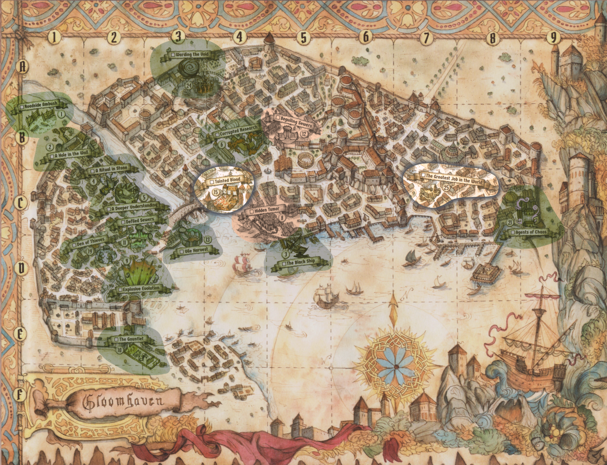
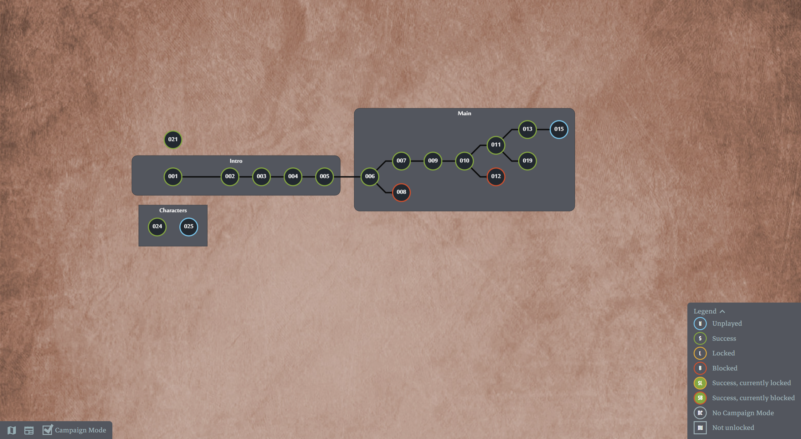

# Gloomhaven: Jaws of the Lion Campaign Tracker

## Admin
### Web app
I am using [Gloomhaven secretariat](https://ghs.champonthis.de/), GHS, to handle most of the game admin, though we still use the character sheets as the source of truth for all informtion.

### Data Dump File
The data dump file (ghs-data-dump_{iso_timestamp}.json) in this repository contains the campaign information exported from GHS
To export the data dump, Go to "Data management" in the menu and click "Export data dump"
To impoort, download the file, go to "Data management" in the menu and double clikc "Import data dump" and select your file.

## Campaign Progress
Here’s a summary of your progress so far:

### Main quest scenarios
- [x] [Roadside Ambush (Scenario 1)](#roadside-ambush-scenario-1)
- [x] [A Hole in the Wall (Scenario 2)](#a-hole-in-the-wall-scenario-2)
- [x] [The Black Ship (Scenario 3)](#the-black-ship-scenario-3)
- [x] [A Ritual In Stone (Scenario 4)](#a-ritual-in-stone-scenario-4)
- [x] [A Deeper Understanding (Scenario 5)](#a-deeper-understanding-scenario-5)
- [x] [Corrupted Research (Scenario 6)](#corrupted-research-scenario-6)
- [x] [Sunken Tumor (Scenario 7)](#sunken-tumor-scenario-7)
- [x] ~~[Hidden Tumor (Scenario 8)](#hidden-tumor-scenario-8)~~
- [x] [Explosive Evolution (Scenario 9)](#explosive-evolution-scenario-9)
- [x] [The Gauntlet (Scenario 10)](#the-gauntlet-scenario-10)
- [x] [Defiled Sewers (Scenario 11)](#defiled-sewers-scenario-11)
- [x] ~~[Beguiling Sewers (Scenario 12)](#beguiling-sewers-scenario-12)~~
- [x] [Vile Harvest (Scenario 13)](#vile-harvest-scenario-13)
- [ ] [Tainted Blood (Scenario 15)](#tainted-blood-scenario-15)

### Side quests scenarios
- [x] [Den of Thieves (Scenario 19)](#den-of-thieves-scenario-19)
- [x] [Agents of Chaos (Scenario 21)](#agents-of-chaos-scenario-21)
- [x] [Warding the Void (Scenario 24)](#warding-the-void-scenario-24)
- [ ] [The Greatest job in the World (Scenario 25)](#the-greatest-job-in-the-world-scenario-25)

## Up Next

### Scenario 15: Tainted Blood (Main Quest) - RETRY
**Story**: Roland's blood cult is poisoning Gloomhaven's water supply. You must destroy the alchemy tables and stop the infection before the city falls.
**Type**: Objective destruction + combat. High spawn rate with Black Imps every round and chain-spawning Blood Imps when Zealots die. **Difficulty: Hard** - we already lost once.

### Scenario 25: The Greatest Job in the World (Side Quest - Demolitionist)
**Story**: The Demolitionist's personal quest - demolish a cursed building while fighting off angry spirits.
**Type**: Destruction + escape. Collapse rooms by destroying pillars, but don't get caught in the rubble. Living Spirits can only die when rooms collapse. **Difficulty: Medium** - ANY character exhaustion = instant loss.

## Character Details 
| Name      |         Class         |           Player |
| :-------- | :-------------------: | ---------------: |
| Carnation | Quatryl Demolitionist |              3dO |
| Wagner    |   Valrath Red Guard   | Legbegbe+Mumetal |
| Adeptus   |     Inox Hatchet      |             Gedo |
| Echo      |   Human Voidwarden    |           Phillz |

## Story so far

### Roadside Ambush (Scenario 1)
- You are part of a group of mercenaries, known as the “Jaws of the Lion”.
- There have been mystery disappearances in the city of Gloomhaven, and you have been hired to investigate.
- On your way back from an unsuccessful mission to find a missing blacksmith, you are ambushed by Vermlings, small and vicious creatures.
- The Vermlings’ proximity to the city is unusual, raising questions about their boldness.
- You are weary from your journey and the ambush, but you decide to investigate.
- Upon investigating, you discover a hole in the city wall, suggesting a possible breach.

### A Hole in the Wall (Scenario 2)
- You investigate the hole in the city wall and find a hidden Vermling lair.
- You fight your way through the lair, dealing with traps and enemies.
- You find a not detailing arrangements between Vermlings and somone named Roland.
- Apparently, the Vermlings are being paid to provide fresh corpses to Roland, and they seem to have killed quite a few people already, before you put a stop to it.
- You rest and recover at the "Sleeping Lion" and try to locate this Roland character.

### The Black Ship (Scenario 3)
- After getting plenty of rest, you set out to find Roland.
- You find some Vermlings and get them to talk, they tell you that they are paid by Roland to deliver bodies and give you their drop-off location.
- The location is a derelict ship at the Old Docks, it's easy to spot as it is leaking a strange black liquid, and there are 2 Zealots guarding it.
- You fight the Zealots and their giant vipers, there is a river of black liquid running through the ship.
- In the final room, a group of Zealots are performing an incantation over an alter piled with severed limbs and mounds of flesh.
- After defeating the Zealots, you sift through the human remains and find a necklace, confirming that Sandy's' husband, the missing blacksmith, is dead.
- You also find a map of the Boiler District, with a location marked on it.

### A Ritual In Stone (Scenario 4)
- You arrive at the building marked on the map, but it's been recently burnt down.
- You search the charred rubble and find a set of stairs leading down to a stone cellar where you hear chanting similar to the one you heard on the ship.
- Their chanting causes 4 massive rune-covered stones to scatter across the room as the floor begins to shake and the the ceiling starts to crumble.
- You fight the Zealots and their Stone Golems, to prevent being buried alive.
- After defeating the Zealots, you head down a tunnel to find answers.

### A Deeper Understanding (Scenario 5)
- You find Zealots who scramble to stall you while they finish their ritual.
- One Zealot who knows he is outmatched, "Opens a rift" and multiple red lights rip open the fabric of reality.
- From the rifts emerge Chaos Demons, one of which engulfs the Zealot who opened the rift, and then they turn their attention to you.
- You defeat the Chaos Demons and head to the next room, where you first encounter a Blood Tumor.
- You fight the blood tumor but it heals by any damage suffered by anyone in the room, and must never get to full health.
- After defeating the Blood Tumor it explodes into a shower of blood and guts, one of the Zealots threatens that "The Blood God will consume the city".
- You try to interrogate him about Roland, but he is already dead, Instead you grab a chunk of the Blood Tumor and bring it to the University for analysis.

### Corrupted Research (Scenario 6)
- You take the chunk of the Blood Tumor to Professor Haltrip, an old **Quatryl** at the University.
- You explain all you know about the Vermling, black sludge, earthquakes, and the tumor, and that there are other tumors out there.
- He runs test to find out what the tumor is made of so he can find a way to track the others
- Something goes horrible wrong in the lab, the growths spread and kill all the lab assistants, and transforms the rats into monstrosities.
- You destroy them before they spread any more, and Halstrip tells you that he has found a way to track the tumors using a stone that glows grean when near them.
- You scour the streets of the city, trying to locate the growths and pinpoint 2 locations, an abandoned set of buildings in the Sinking Market and a warehouse down at the Old Docks.
- With any luck, you'll find Roland.

### Sunken Tumor (Scenario 7)
- You encounter more Vermlings and Zealots at 'the Sinking Market', and you fight your way through them.
- Then you find a door that leads to another Blood Tumor.
- After defeating the Blood Tumor, you burn the remains to ensure it never plagues the city again.

### Hidden Tumor (Scenario 8)
- As you finish at the Sinking Market, you see the other blood tumor location go up in flames.
- You were too late, the explosion is just the beginnins, you make your way to the Old Docks ASAP.
- **CLOSED** - You had a choice between Scenario 7 (Sunken Tumor) and Scenario 8 (Hidden Tumor). Completing Scenario 7 closed this path.

### Explosive Evolution (Scenario 9)
- You arrive at the scene of the explosion, and the tumor has evolved to a Blood Horror.
- The Blood Horror cannot be damaged until you kill all the Zealots, when Zealots die, they can be revived as "Living Corpses".
- After defeating the Zealots, you are done, as far as you can tell. 
- You have destroyed the creatures of Blood that plagued the city, and have thwarted the group behind the disappearances.
- You can finally respond to the widow, and update the city guards with all you have learned.
- They can mop up the rest of this stupid cult, and you can go back to actually getting paid to kill things.
- As you walk toward the Sleeping Lion, dreaming of a hot bath, you remember a rumor about someone along the Hook Coast offering Gold to mercenaries, who would come and fight in his "gauntlet".

### The Gauntlet (Scenario 10)
- You travel to the Hook Coast, outside Gloomhaven's walls, to investigate a "gauntlet" built by a madman offering 10 gold to anyone who survives.
- The entire platform is a giant deathtrap with moving traps that shift every round - some move downward and wrap around, others home in on characters.
- When traps spring, they hit not just the triggering figure but all adjacent figures too.
- You fight through Stone Golems, Chaos Demons, and Black Sludges.
- At the end, you find Roland has fled, leaving a mocking note calling you "worthy opponents" but claiming you're still doomed like the rest of the city.
- **Unlocks**: The city guard informs you of red-robed cultists in the sewers, unlocking Scenario 11 (Defiled Sewers) and Scenario 12 (Beguiling Sewers).

### Defiled Sewers (Scenario 11)
- You descend into the foul, submerged tunnels beneath the Sinking Market to track down the blood cult.
- The sewers are filled with Black Sludges, Giant Vipers, and Vermlings, with your path blocked by a massive iron sluice gate.
- To open the gate, you must pull a rusty lever - but doing so releases a torrent of water, turning the mission into a desperate survival race.
- **Unique Mechanic**: If any character becomes exhausted, the entire scenario is immediately lost. The current forces every figure to move one hex downward each round.
- After fighting through the flood and escaping to a higher platform, the water washes the remaining monsters away toward the bay.
- **Reward**: Flea-Bitten Shawl (Item 28).
- **Unlocks**: Scenario 13 (Vile Harvest) and Scenario 19 (Den of Thieves). Closes Scenario 12 (Beguiling Sewers).

### Beguiling Sewers (Scenario 12)
- **CLOSED** - You had a choice between Scenario 11 (Defiled Sewers) and Scenario 12 (Beguiling Sewers). Completing Scenario 11 closed this path.

### Vile Harvest (Scenario 13)
- After the flood recedes, you find a chamber filled with foul, dark red liquid where cultists are performing a ritual to grow "vile blood creatures" from black sludge.
- You must shut down this "factory of revulsion" by engaging the cultists and their creations.
- **Unique Mechanic**: Every other round, a Blood Imp spawns adjacent to a Black Sludge - this continues as long as that Black Sludge remains alive.
- The cultists refuse to provide information on Roland, so your only choice is to press deeper into the blood-soaked tunnels.
- **Unlocks**: Scenario 15 (Tainted Blood).

### Tainted Blood (Scenario 15)
- **STATUS: ATTEMPTED (1 LOSS)** - We tried this scenario once and failed.
- Roland taunts you as you discover Zealots poisoning Gloomhaven's water supply with black liquid from alchemy tables.
- A Zealot reveals that the "gift" from their Blood God is already infecting the city - everyone will soon be slaves.
- **Objective**: Destroy all alchemy tables and kill all enemies.
- **Unique Mechanics**:
  - Black Imps spawn adjacent to each revealed alchemy table at the start of every round.
  - When a Zealot dies, an elite Blood Imp spawns in its hex, plus normal Blood Imps spawn near all Zealots within Range 3.
  - Locked doors only open once the three center alchemy tables are destroyed.
- **Rewards** (when completed): 10 gold per character, Items 21-26 added to shop.
- **Unlocks**: Scenario 16 (Mixed Results).

## Side Quests

### Den of Thieves (Scenario 19)
- You return to the tunnels connected to the sewers to deal with a Vermling infestation possibly linked to the blood cult.
- Past the rusted lever from the previous sewer mission, you find an older network of passageways with savage creatures - matted fur and oozing growths.
- **Objective**: Destroy all four Vermling nests and loot the treasure tiles that appear in their hexes.
- **Unique Mechanic**: Nests have health based on scenario level and player count. When destroyed, a treasure tile appears that must be looted to complete the scenario.
- You confirm a connection between the deformed rats, Vermlings, and the blood cult, but find no hard evidence on Roland.
- **Reward**: Ring of Strength (Item 31).

### Agents of Chaos (Scenario 21)
- You follow the directions of a merchant to some small warehouses in the district.
- As you approach you have a strong feeling that something is wrong.
- You encounter Chaos Demons and the more you progress the worse the sensation gets.
- The pain throbs deeper and eventually you start to loose health as you walk.
- You defeat the Vipers and the Chaos Demons and your sanity comes back.
- You return to the **Valrath** merchant and he pays you for your efforts.

### Warding the Void (Scenario 24)
- You accompany the Voidwarden to the southeastern edge of the Void - a violent storm of grating black sand.
- The Voidwarden plants three magical wards to calm the winds, but the Void manifests creatures to destroy them.
- **Objective**: Protect the three wards and kill all enemies.
- **Unique Mechanics**:
  - If any ward is destroyed, the scenario is lost. Characters can discard cards to negate ward damage.
  - All hexes are black sand - ending a round there deals damage based on scenario level.
  - If the Voidwarden becomes exhausted, the scenario is lost.
  - Enemies spawn in waves after previous groups are defeated.
- After surviving the onslaught, the Voidwarden stays behind to ensure the area remains stable.
- **Reward**: Robes of Command (Item 35).

### The Greatest Job in the World (Scenario 25)
- The Demolitionist takes on a contract to destroy a derelict, potentially haunted building.
- Rumors of a "curse" prove true - lingering spirits are determined to stop the demolition.
- **Objective**: Destroy all pillars and escape the wreckage.
- **Unique Mechanics**:
  - Pillars have HP based on scenario level + player count.
  - When all pillars in a room and its door are destroyed, that room collapses - destroyed hexes can't be entered.
  - Characters in a destroyed room suffer 10 damage and must escape to the nearest non-destroyed hex.
  - Living Spirits can only be killed when their room is destroyed.
  - If any character becomes exhausted, the scenario is lost.
- After leveling the building, the spirits dissipate and the foreman rewards the team.
- **Reward**: Jet Boots (Item 36).

